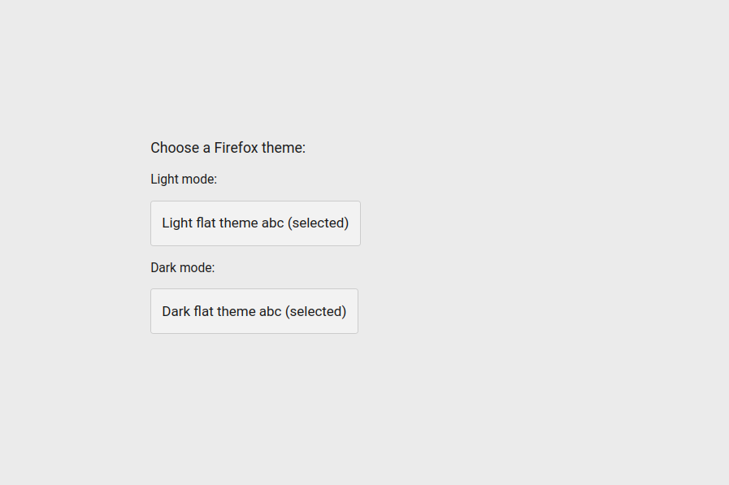

# auto-theme-switcher
Automatically change the browser theme based on the operating system's light or dark color scheme. 
Note: Works unstable with certain theme settings in the extension and with the system light and dark browser theme.

